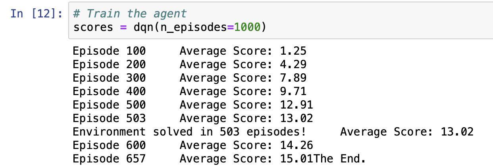
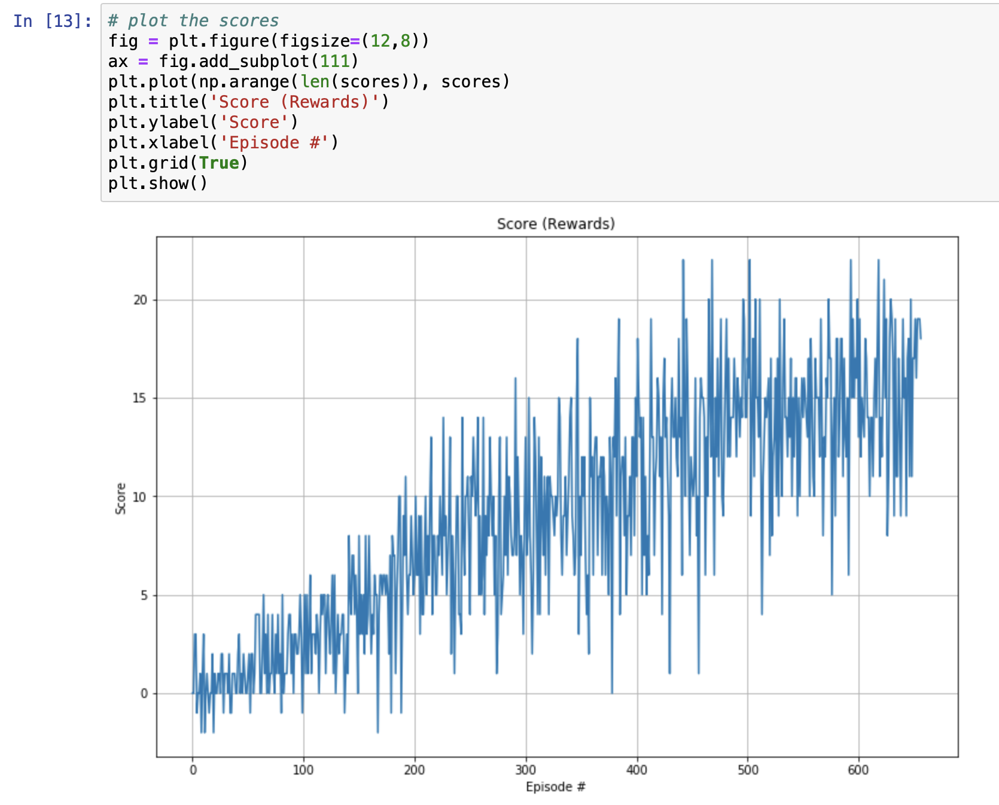

# Deep Reinforcement Learning : Navigation

This repository contains my implementation of the [Udacity Deep Reinforcement Learning Nanodegree]((https://www.udacity.com/course/deep-reinforcement-learning-nanodegree--nd893)) Project 1 - Navigation

## Project's Goal  

We will train an agent to navigate a large, square world and collect yellow bananas. The world contains both yellow and blue banana as depicted in the animatation below. We want the agent to collect as many yellow bananas as possible while avoiding blue bananas. The task is episodic, and in order to solve the environment, the agent must get an average score of +13 over 100 consecutive episodes.


### Rewards

1. The agent is given a reward of +1 for collecting a yellow banana
1. Reward of -1 for collecting a blue banana

### State Space  

The state space has 37 dimensions and contains the agent's velocity, along with ray-based precpetion of objects around the agent's foward direction.

### Actions  

Four discrete actions are available, corresponding to:

- `0` - move forward
- `1` - move backward
- `2` - turn left
- `3` - turn right

<br>
<br>

## Deep Q-Networks

This project implements a *Value Based* Reinforcement Learning method called [Deep Q-Networks (DQN](https://deepmind.com/research/dqn/). DQN is a variant of Q-learning. For more information on Q-learning, please refer to [Q-learning](https://en.wikipedia.org/wiki/Q-learning#Deep_Q-learning)

> For any finite [Markov decision process](https://en.wikipedia.org/wiki/Markov_decision_process) (FMDP), Q-learning finds an optimal policy in the sense of maximizing the expected value of the total reward over any and all successive steps, starting from the current state. Q-learning can identify an optimal action-selection policy for any given FMDP, given infinite exploration time and a partly-random policy. "Q" refers to the function that the algorithm computes - the expected rewards for an action taken in a given state.

When dealing with a complex environment (states, actions), the Q-table becomes inefficient quickly. 
> For most problems, it is impractical to represent the Q-function as a table containing values for each combination of state and action [Source](https://www.tensorflow.org/agents/tutorials/0_intro_rl)

DQN algorithm represents the optimal action-value function $q_{*}$​ as a neural network. DQN allows utilizing a neural network to apporximate the Q. However, DQN faces its own challenges.

> Reinforcement learning is unstable or divergent when a nonlinear function approximator such as a neural network is used to represent Q. This instability comes from the correlations present in the sequence of observations, the fact that small updates to Q may significantly change the policy of the agent and the data distribution, and the correlations between Q and the target values.
[Source](https://en.wikipedia.org/wiki/Q-learning#Deep_Q-learning)

Here we addresses these instabilities by using the two key techniques:

 1. Experience Replay: instead of discarding experiences after one training, it allows the agent to remember the past experiences and learns from them repeatedly, as if that experience had happened again. After collecting certain amount of experiences, it allows the agent to sample a batch of previous experiences (`ReplayBuffer` class in `dqn_agent.py` is used for this purpose). This removes correlations in the observation sequence

 2. Fixed Q-Target: Using the same Q-network to both compute the predicted value and the target value, which used in calculating the loss, can lead to harmful correlations, which implies we use a constantly moving target. In order to handle this, we introduce two separate neural networks (primary network and target network) with the identical architecture. The target network's weights are not changed during the learning step. Its weights are frozen with the primary network's weights, its being updated to the primary network's new weights every certain amount of time steps.

<br>
<br>

## Algorithm and Implementation


This screenshot is taken from the [Deep Reinforcement Learning Nanodegree course](https://www.udacity.com/course/deep-reinforcement-learning-nanodegree--nd893)

### Code Implementation

The implementation is borrowed from the 'LunarLander-v2' coding exercise from the 'Deep Q-Network' part in Udacitiy [Deep Reinforcement Learning Nanodegree](https://www.udacity.com/course/deep-reinforcement-learning-nanodegree--nd893) program.

- `model.py`
  - Here we define the neural networks, `QNetwork` class. The primary and target Q-network have the identical structure. Currently, I included fully-connected layers, with 64 nodes each. The first layer takes the input with the size of `state_size`, which is 37 in this environment, and connects to the first 64 node hidden layer. Then we have another 64 to 64 hidden layer, and finally a connection between the last hidden layer and the output layer (with the size of `action_size`, which is 4 in this environment). I used ReLU as the activation function.
  - The Neural Networks use the following architecture :
    
- `dqn_agent.py`
  - There are two classes in here, `Agent` adn `ReplayBuffer`. In `Agent`, we initialize two Q-networks to stablize, avoiding chasing a moving target. In every `UPDATE_EVERY` time step, if there are enough collections of experience tuples in the memory (which instantiated from `ReplayBuffer`), the agent learns. It "soft-"updates value parameters using given batch of experience tuples. With RepayBuffer and two identical Q-networks, we implemented (a) Experience Replay and (b) Fixed Q-Target techniques
- `Navigation.ipynb`
  - Here we actually train the agent. The parameters used in the training is in below
- `checkpoint.pth`: this contains the agent's primary network's learnable parameters, weights and biases. The file extention, `.pth`, is a common PyTorch convention to save models
  
### DQN Parameters

The DQN agent uses the following parameters values (defined in dqn_agent.py)

```Python
# agent parameters
BUFFER_SIZE = int(1e5)  # replay buffer size
BATCH_SIZE = 64         # minibatch size 
GAMMA = 0.995           # discount factor 
TAU = 1e-3              # for soft update of target parameters
LR = 5e-4               # learning rate 
UPDATE_EVERY = 4        # how often to update the network

# training parameters
n_episodes = 1000       # maximum number of training episodes
max_t = 1000            # maximum number of timesteps per episode
eps_start = 1.0         # starting value of epsilon, for epsilon-greedy action selection
eps_end = 0.01          # minimum value of epsilon
eps_decay = 0.995       # multiplicative factor (per episode) for decreasing epsilon

```

The Neural Networks use the Adam optimizer as shown below:


### The Result

Given the chosen architecture and parameters, the result looks like below:

#### Training log



#### Scores



After the environment was solved in 426 episodes, I decided to run more episodes if it continues to produce an average score (over 100 consecutive episodes) that is greater than 13.0 until it becomes 15.0. It appears to me that it will continue to produce an average score that is greater than 13.0.

### Ideas for Future Work

This repository only contains a vanilla Q-network with fully connected layers, with only 64 nodes. This might be enough to resolve the enviroment in 426 episodes but I think there is a lot of room for improvement. I have not tried Double DQN, Prioritized Experience Replay, and Dueling DQN. There is no guarantee in advance that these will improve the performance but it's worth trying all three.  

Also, as mentioned in the Udacity Deep Reinforcement Learning Nanodegree project, using the raw pixels as an input would be a good future work. The state will be, in this case, 84 x 84 RGB image rather than 37 features (that are velocity, ray-based precpetion of objects around the agent's foward direction). Including [Convolutional Neural Network](https://en.wikipedia.org/wiki/Convolutional_neural_network) in the Q-network will probably suit well for this purpose and also image preprocessing would be needed.
